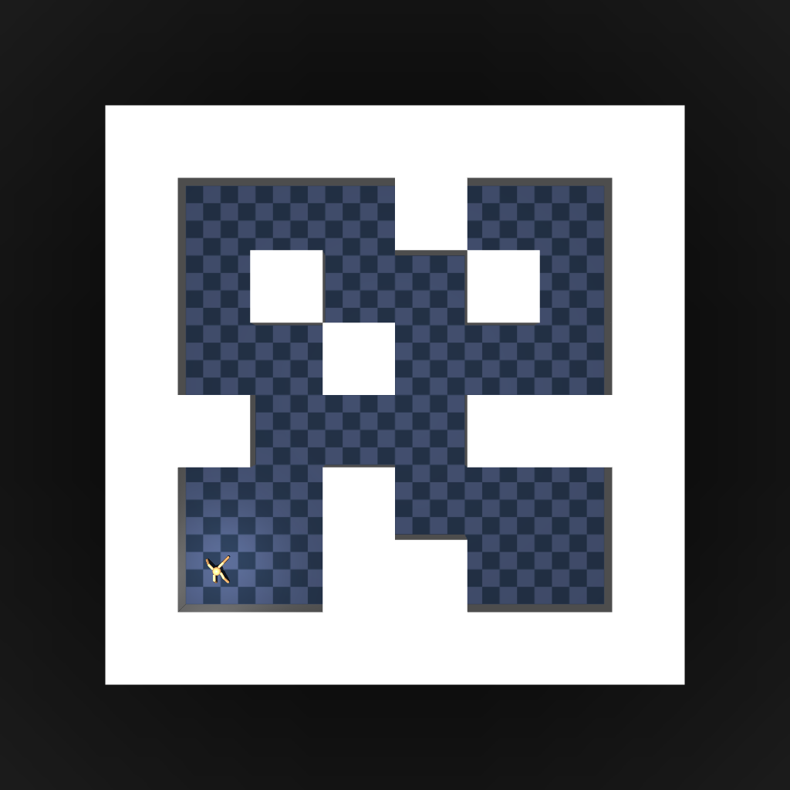
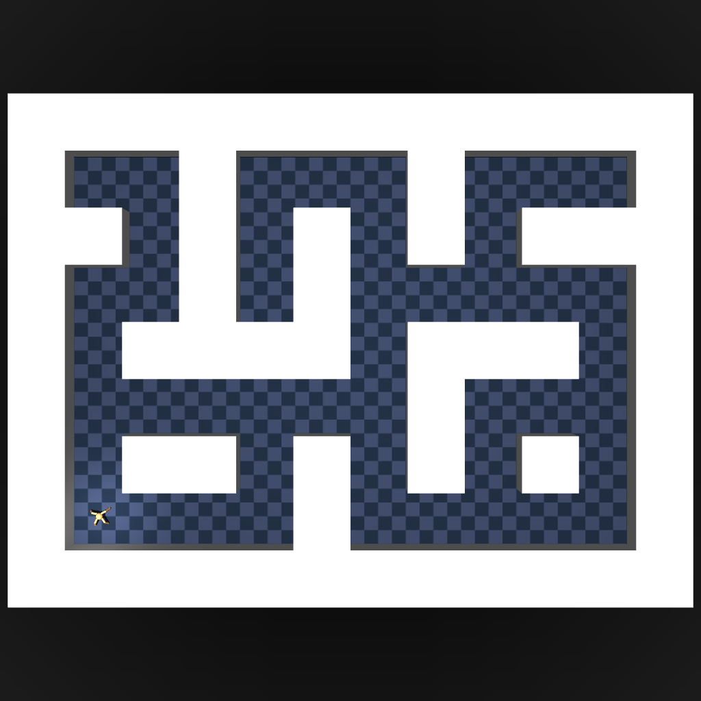
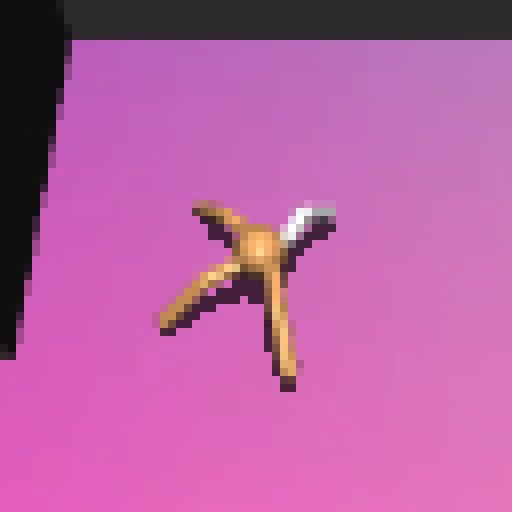
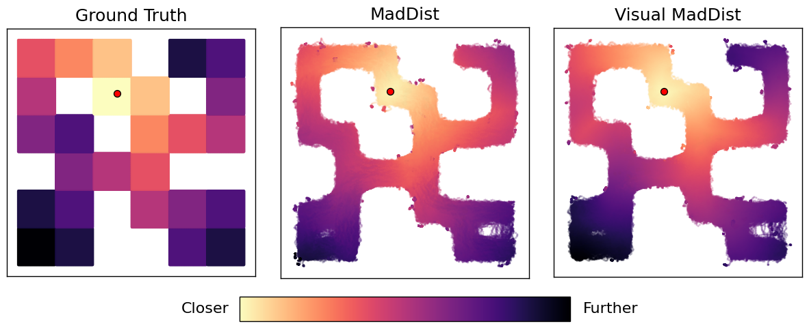
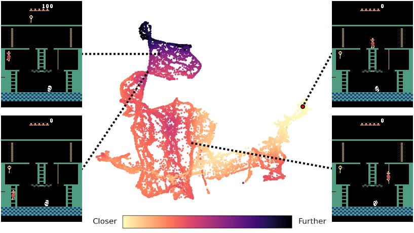

# Learning the Minimum Action Distance in Pixel-Based Environments

This repository contains the codebase for my final-year research project at the University of Bath, *Learning the Minimum Action Distance in Pixel-Based Environments*.

## Overview

A key challenge in training autonomous agents is enabling them to establish a fundamental structural understanding of their surroundings. 
One highly effective approach for capturing this topology is learning the Minimum Action Distance (MAD), 
a temporal distance metric defined as the minimum number of steps required to move between two states.

While existing methods successfully approximate the MAD in simple, low-dimensional environments, 
their scalability to the high-dimensional observations necessary for practical applications has remained an open question.

### Our Approach

In this project, we demonstrate that the MAD can be effectively learned directly from high-dimensional, pixel-based inputs
by augmenting two MAD approximation algorithms with convolutional encoders. We evaluate our methods on the OGBench AntMaze
Environments, as well as the notoriously complex Montezuma's Revenge environment.

<p align="center">
  
  
  
</p>

> *Overview of the OGBench AntMaze environments used in our project. The first two images show the top-down layouts of the Medium and Large maze variants, respectively. The third depicts an example 64×64×3 pixel-based observation, showing the coloured floor used by the agent for spatial inference.*

### Key Findings

- Counter-intuitively, our visual architectures consistently outperformed traditional state-based methods on continuous maze environments,
  demonstrating that they can learn robustly from high-dimensional observations alone.
- Our approach successfully isolated structural bottlenecks and learned coherent state representations in the highly complex Montezuma's Revenge environment, where true temporal distances are unknown.
- These results demonstrate that complex sensory data can reliably capture the underlying structure of an environment, serving as a crucial
  stepping stone toward developing more capable autonomous systems in deep reinforcement learning.

<p align="center">
  <figure>
    
  </figure>
</p>

> *Visualisations of final-step learned distance metrics 
      on the OGBench AntMaze Medium environment. From left to right: 
      the ground-truth MAD computed via the Floyd-Warshall algorithm, 
      the state-based MadDist baseline, and our augmented Visual MadDist architecture.*

<p align="center">
  <figure>
    
  </figure>
</p>

> *Visualisation of the largest state cluster identified by applying HDBSCAN to the two-dimensional UMAP projection
      of the latent state space learned by Visual MadDist, which corresponds to the starting room of Montezuma's Revenge. 
      States are coloured by the learned MAD from the game's initial state (identified as the red point). 
      Four example frames illustrate the agent's progression through this cluster. Clockwise from top-right: (i) 
      the starting position; (ii) navigating the main chamber; (iii) reaching the bottleneck of the left ladder; 
      and (iv) collecting the key after climbing the ladder.*

## Installation and Usage

This project uses [uv](https://github.com/astral-sh/uv) as a package and virtual environment manager. To set up and run the project code, follow these steps:

1. **Clone the repository**:

   ```sh
   git clone https://github.com/benjaminrall/pixel-based-mad-learning.git
   cd pixel-based-mad-learning
   ```
   
2. **Sync the project using [uv](https://github.com/astral-sh/uv)**:

   ```sh
   uv sync
   ```

   This will install all packages required to run the project code.
   Our core dependencies are PyTorch for training models and Minari for interfacing with offline datasets. 

3. **Download and process environments**:

   We provide a script to download OGBench AntMaze datasets and process them into local Minari datasets in order to interface with our code. This can be run using the following command:

   ```sh
   uv run antmaze_download.py -s visual-antmaze-medium-navigate-v0 -t ogbench/antmaze/visual-medium-navigation-v0
   ```

   The source (`--source`, `-s`) and target (`--target`, `-t`) flags define the OGBench dataset ID to be downloaded and the desired local Minari identifier respectively. This process
   by default saves downloaded OGBench files to `./.cache/ogbench/`, which can be safely deleted after processing. Minari datasets are saved locally to `~/.minari`.

   To train on Montezuma's Revenge, the dataset must first be downloaded from the [Atari Grand Challenge GitHub page](https://github.com/yobibyte/atarigrandchallenge), and extracted into `./cache/atari`. Then, the `Montezuma's Revenge Dataset` notebook can be used to process it into a Minari dataset.(Note: using this dataset requires a lot of free storage space - when cached for training, it uses ~62GB)

4. **Train a model**:

   Our main training code can be run in two ways: using the `--config` flag to start a new run from a config YAML file, or using the the `--checkpoint` file to load and continue a run from a checkpoint.

   **Using a config file**:
   ```sh
   uv run main.py --config configs/visual-maddist/antmaze-medium.yaml
   ```

   **Using a checkpoint**:
   ```sh
   uv run main.py --checkpoint checkpoints/visual-maddist-antmaze-medium/40000.pt
   ```

   During training, checkpoints will be saved by default to `./checkpoints/<run_name>`. If `track_wandb` is set to true, then an appropriate W&B project must be provided, and you must provide your W&B API
   key as the `WANDB_API_KEY` environment variable, either globally or by placing it in a `.env` file.

5. **Analyse results**:
   
   Results can be visualised using the `Visualise AntMaze` and `Visualise Montezuma's Revenge` notebooks. Visualisations are generated by loading a training checkpoint, the path for which must be specified in the notebooks. For AntMaze, we generate a maze heatmap using the agent's position metadata to plot the states, which are then coloured by their distance from some goal state. For Montezuma's Revenge, we apply UMAP and HDBSCAN to project the latent state space to 2 dimensions and identify associated states (which are coloured according to their cluster assignments).

   Additionally, raw training data and plots of quantitative metrics for the AntMaze environments are logged to W&B, if `track_wandb` is set to true.


## Citation

If you use this code or find our work helpful, please consider citing our project:

```bibtex
@mastersthesis{visualmad_rall_2026,
  author       = {Rall, Benjamin},
  title        = {Learning the Minimum Action Distance in Pixel-Based Environments},
  year         = {2026},
  school       = {University of Bath},
  type         = {MComp Final Year Research Project},
}
```

## License

This project is licensed under the **GNU General Public License v3.0**. See the [`LICENSE`](./LICENSE) file for details.
